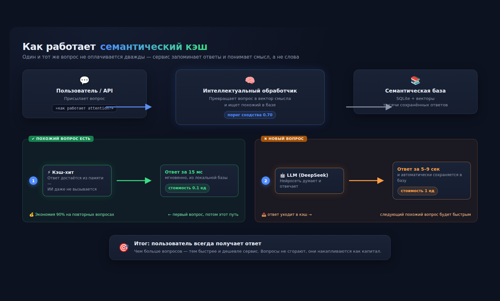
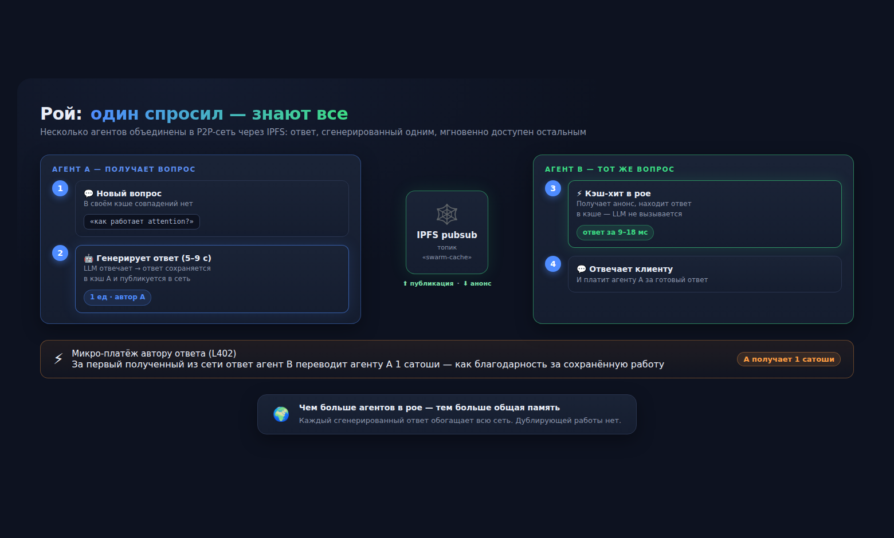

# Контент-кит Swarm Cache v1.0

Готовые тексты для публикации. Выбирай формат — копируй, вставляй, публикуй.

---

## 1. Статья для Habr / vc.ru (длинный формат, ~700 слов)

### Заголовок (выбери один):
- «Я собрал ИИ-сервис, который запоминает ответы. Повторные вопросы — за 15 мс и в 10 раз дешевле»
- «Семантический кэш для LLM: как я ускорил ответы ИИ в 300 раз и сэкономил 90% на API»
- «Один агент спросил — весь рой знает: P2P-кэш для ответов нейросетей»

### Текст:

Почти любой сервис с ИИ отвечает на одни и те же вопросы снова и снова. Клиенты спрашивают одно и то же, поддержка отвечает одинаково, а вы платите API-провайдеру за каждый запрос — даже за те, ответ на которые уже известен.

Я собрал сервис, который решает эту проблему: **Swarm Cache** — ИИ, который запоминает ответы.

**Как это работает**

Когда приходит новый вопрос, сервис генерирует ответ нейросетью и сохраняет его в семантическую базу. Если вопрос задают снова — или похожий по смыслу — сервис не вызывает ИИ, а достаёт готовый ответ из памяти.

Ключевое слово — «семантический». Это не тупое сравнение строк: система понимает, что «объясни, как работает attention» и «что такое attention в трансформерах» — это один и тот же вопрос. Эмбеддинги считаются локально, порог сходства калибруется.



**Цифры, которые получаются на практике:**

- Новый вопрос (генерация LLM): 5–9 секунд, полная стоимость
- Повторный вопрос (кэш-хит): 12–30 миллисекунд, 0.1 от стоимости
- Экономия токенов на серии повторных запросов: 70–80%

То есть повторный ответ приходит в **300 раз быстрее** и стоит **в 10 раз дешевле**.

**Дальше — интереснее: рой**

Я пошёл дальше и сделал P2P-обмен. Несколько агентов (каждый со своим кэшем) объединены в рой через IPFS pubsub. Если агент A сгенерировал ответ, он публикует его в сеть — и агент B отвечает на тот же вопрос мгновенно, не тратя ни токена, ни секунды.

Между агентами — микро-платежи в духе L402: за полученный ответ автору начисляется 1 сатоши. Это задел на будущее: открытый рой, где каждый участник и потребитель, и поставщик.



**Что внутри (стек)**

- Семантический кэш: SQLite + sqlite-vec, локальные эмбеддинги (multilingual MiniLM)
- LLM: DeepSeek V4 Flash через OpenAI-совместимый API
- P2P: IPFS kubo + pubsub, DAG-публикация ответов
- API-ключи, биллинг, rate limiting, self-serve регистрация

**Можно попробовать прямо сейчас**

https://swarm.telscan.ru — на сайте есть демо: 3 бесплатных вопроса в день без регистрации. Ввёл имя — получил ключ и 10 бесплатных вопросов.

Подключение — один HTTP-запрос:

```
curl -X POST https://swarm.telscan.ru/ask \
  -H "X-API-Key: ваш_ключ" \
  -H "Content-Type: application/json" \
  -d '{"question":"Что такое Attention?"}'
```

Код открыт: https://github.com/Vadim945/swarm-cache

**Кому это нужно**

- Чат-ботам и поддержке: клиенты задают одно и то же — отвечайте из кэша
- FAQ и справочникам: сотни одинаковых вопросов, мгновенные ответы
- Любому сервису с ИИ: меньше расходов на API, быстрее отклик

Главная идея: чем больше вопросов — тем быстрее и дешевле работает сервис. Вопросы не сгорают, они накапливаются как капитал.

---

## 2. Короткий анонс для Telegram-чатов / каналов

> 🐝 Сделал ИИ-сервис, который запоминает ответы.
>
> Первый вопрос — нейросеть думает 5–9 секунд. Повторный или похожий — ответ из памяти за 15 мс и в 10 раз дешевле. Понимает смысл, а не слова: «что такое attention» и «как работает attention» — это один ответ.
>
> Попробовать можно прямо на сайте, без регистрации — 3 бесплатных вопроса:
> https://swarm.telscan.ru
>
> Код открыт: github.com/Vadim945/swarm-cache
>
> Подходит чат-ботам, FAQ, поддержке. Приводите друзей — бонусы обоим 😉

---

## 3. Пост для X / Twitter

> Built an LLM service that remembers answers.
>
> New question: 5–9s, full price.
> Repeat or similar question: 15ms, 10× cheaper.
>
> Semantic cache + IPFS P2P swarm + micro-payments (L402-style). 1 satoshi to the author per shared answer.
>
> Try it free (3 questions, no signup): https://swarm.telscan.ru
> Open source: github.com/Vadim945/swarm-cache

---

## 4. Пост для LinkedIn

> I've been working on a problem most AI services have: paying the LLM provider full price for questions that have already been answered.
>
> Swarm Cache solves this with a semantic cache — the service remembers answers and serves similar questions from memory in ~15ms instead of 5–9s, at 1/10th the cost.
>
> It also runs as a P2P swarm over IPFS: answers generated by one agent are shared with the whole network. Micro-payments (L402-style) reward answer authors with satoshis.
>
> Live demo (3 free questions, no signup): https://swarm.telscan.ru
> Source: https://github.com/Vadim945/swarm-cache
>
> #AI #LLM #IPFS #SemanticCache #OpenSource

---

## 5. Куда публиковать (без своей аудитории)

1. **Habr** (habr.com) — зарегистрироваться (бесплатно), раздел «Разработка» → «Блог компании» не нужен, обычный пост в личный блог. Алгоритмы показывают пост заинтересованным. Лучшие теги: ИИ, разработка, Open Source.
2. **vc.ru** — раздел «Стартапы» или «Технологии». Тоже работает алгоритмическая лента.
3. **Telegram-чаты про ИИ** — чаты типа «AI Chat», «ChatGPT RU», «Нейросети и ИИ» (поиск через @tginfo или tgstat). Постить как ответ/историю, не спам.
4. **Product Hunt** — запуск проекта, если пойдёт трафик.

---

## 6. Честные предупреждения

- На Хабре пост без картинок/схем читают хуже. Если пойдёт — сделаю схемы (SVG).
- Публикация на Habr/VC требует аккаунта — это действие Вадима (или его явное разрешение).
- Первый пост — это тест, не жди шквала в первый день. Работает накопительно.
